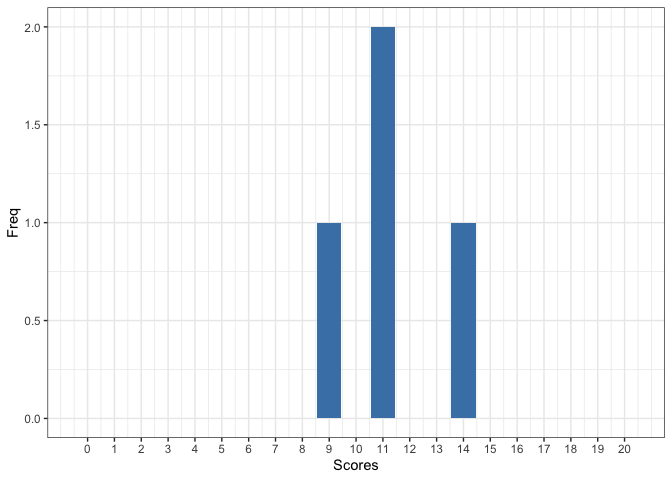
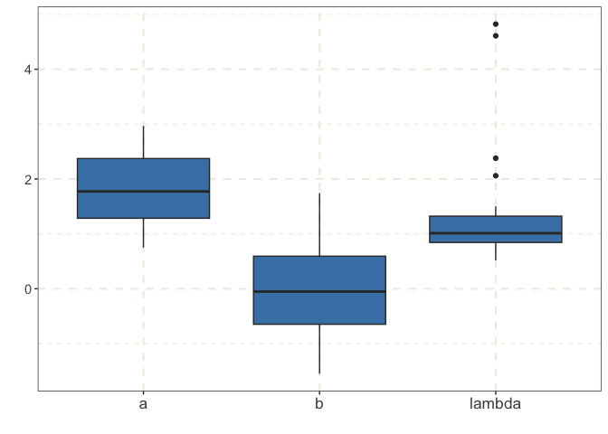
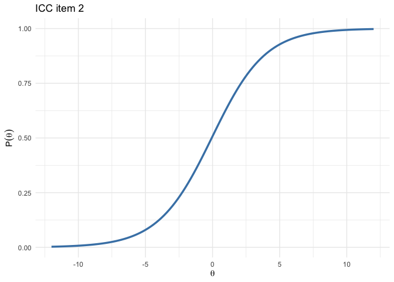
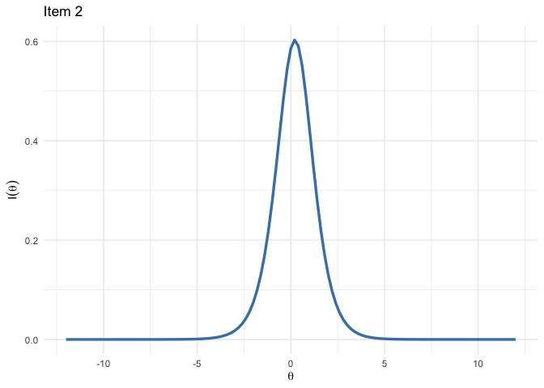

<!-- README.md is generated from README.Rmd. Please edit that file -->

``` r
library(AsymmIRT)
```

# AsymmIRT: Bayesian analysis of asymmetrical IRT models (RLPE, LPE) models and symmetrical IRT models

<!-- badges: start -->

<!-- badges: end -->

The goal of AsymmIRT is to perform bayesian analysis of asymmetrical IRT
models (e.g 1PLPE, 1PRLPE, LPE, RLPE) and widely known symmetrical
models such as 1PL and 2PL. The family of LPE models considers a
parameter which introduces asymmetry in the ICC.

## Installation

AsymmIRT uses [`cmdstanr`](https://mc-stan.org/cmdstanr/) (not available
on CRAN), to install it you should follow these instructions [Getting
started with
CmdStanR](https://mc-stan.org/cmdstanr/articles/cmdstanr.html)

You can install the development version of AsymmIRT like so:

``` r
remotes::install_github("Asymmetrical-irt/AsymmIRT")
```

## Data simulation

This is a basic example on how to simulate data from the available
asymmetrical and symmetrical models. The user can also plot the scores
and the parameters of the simulated data. There is also a way to print a
summary of the dataset.

``` r
j = 20 ## number of items
k = 4      ## number of individuals
model_type   = "LPE"   ## type of model to simulate data from (e.g LPE, RLPE,1PRLPE)
seed = 123  
```

``` r
library(AsymmIRT)

data <- simData(j =20 , k = 4, seed = 123,model_type ="LPE")


plot(data)
#> 
#> --- Scores plot ---
```

<!-- -->

    #> 
    #> --- Parameters Boxplot ---

<!-- -->

``` r
print(data)
#>         mean    sd proportion_0 proportion_1 kappa
#> Item_1  1.00 0.000         0.00         1.00   1.0
#> Item_2  0.50 0.577         0.50         0.50   0.0
#> Item_3  1.00 0.000         0.00         1.00   1.0
#> Item_4  0.75 0.500         0.25         0.75   0.5
#> Item_5  0.25 0.500         0.75         0.25   0.5
#> Item_6  1.00 0.000         0.00         1.00   1.0
#> Item_7  0.75 0.500         0.25         0.75   0.5
#> Item_8  1.00 0.000         0.00         1.00   1.0
#> Item_9  1.00 0.000         0.00         1.00   1.0
#> Item_10 0.25 0.500         0.75         0.25   0.5
#> Item_11 0.25 0.500         0.75         0.25   0.5
#> Item_12 0.75 0.500         0.25         0.75   0.5
#> Item_13 0.25 0.500         0.75         0.25   0.5
#> Item_14 1.00 0.000         0.00         1.00   1.0
#> Item_15 0.75 0.500         0.25         0.75   0.5
#> Item_16 0.25 0.500         0.75         0.25   0.5
#> Item_17 0.00 0.000         1.00         0.00   1.0
#> Item_18 0.25 0.500         0.75         0.25   0.5
#> Item_19 0.25 0.500         0.75         0.25   0.5
#> Item_20 0.00 0.000         1.00         0.00   1.0
#> 
#> Items unbalanced according to kappa index:
#>  [1] "Item_1"  "Item_3"  "Item_4"  "Item_5"  "Item_6"  "Item_7"  "Item_8" 
#>  [8] "Item_9"  "Item_10" "Item_11" "Item_12" "Item_13" "Item_14" "Item_15"
#> [15] "Item_16" "Item_17" "Item_18" "Item_19" "Item_20"
```

## Fitting the data to a model

Fitting models under the AsymmIRT package relies on pre-compiled models,
which are pre-compiled using the *instantiate* package, which manages
the compilation and loading of the Stan models. It is important to
notice that the function fit_model() accepts the same arguments as the
sample method in CmdStanR.

Additionally and since computing metrics such as WAIC, DIC and loo can
be computationally expensive, the available models for fitting has a
’\_log’ suffix, if the user chooses, for example, ‘1PLPE_log’ instead of
‘1PLPE’ then they can use the methods in the package to compute these
metrics.

``` r
iter_warmup = 200 ## number of items
iter_sampling = 200      ## number of individuals
model_type   = "1PLPE_log"   ## type of model 
seed = 123  
data = data$df 
chains = 2 ## number of chains
parallel_chains = 2 ## Running chains in parallel
```

Notice that the function fit_model() returns a list of three objects.
The data list, type of model and the **output** which is a R6
CmdStanMCMC object.

``` r
data <- simData(j =20 , k = 4, seed = 123,model_type ="LPE")
fit <- AsymmIRT::fit_model(data = data$df, iter_warmup = iter_warmup, iter_sampling = iter_sampling, mod = "LPE2_log", seed = seed, chains = chains, parallel_chains = parallel_chains)
#> Running MCMC with 2 parallel chains...
#> 
#> Chain 1 Iteration:   1 / 400 [  0%]  (Warmup) 
#> Chain 1 Iteration: 100 / 400 [ 25%]  (Warmup) 
#> Chain 1 Iteration: 200 / 400 [ 50%]  (Warmup) 
#> Chain 1 Iteration: 201 / 400 [ 50%]  (Sampling) 
#> Chain 1 Iteration: 300 / 400 [ 75%]  (Sampling) 
#> Chain 2 Iteration:   1 / 400 [  0%]  (Warmup) 
#> Chain 2 Iteration: 100 / 400 [ 25%]  (Warmup) 
#> Chain 2 Iteration: 200 / 400 [ 50%]  (Warmup) 
#> Chain 2 Iteration: 201 / 400 [ 50%]  (Sampling) 
#> Chain 2 Iteration: 300 / 400 [ 75%]  (Sampling) 
#> Chain 2 Iteration: 400 / 400 [100%]  (Sampling) 
#> Chain 1 Iteration: 400 / 400 [100%]  (Sampling) 
#> Chain 1 finished in 0.1 seconds.
#> Chain 2 finished in 0.1 seconds.
#> 
#> Both chains finished successfully.
#> Mean chain execution time: 0.1 seconds.
#> Total execution time: 0.2 seconds.
```

``` r
code(fit)
#>  [1] "data {"                                                     
#>  [2] "  int<lower=0> n;"                                          
#>  [3] "  int<lower=0> k;"                                          
#>  [4] "  array[n, k] int<lower=0, upper=1> Y;"                     
#>  [5] "}"                                                          
#>  [6] "parameters {"                                               
#>  [7] "  vector[n] theta;"                                         
#>  [8] "  vector[k] b;"                                             
#>  [9] "  vector<lower=0>[k] a;"                                    
#> [10] "  vector<lower=0>[k] lambda;"                               
#> [11] "}"                                                          
#> [12] "transformed parameters{"                                    
#> [13] ""                                                           
#> [14] "  matrix[n,k] m;"                                           
#> [15] "  matrix<lower=0, upper=1>[n, k] pl;"                       
#> [16] "  matrix<lower=0, upper=1>[n, k] prob;"                     
#> [17] ""                                                           
#> [18] " for (j in 1:k) {"                                          
#> [19] "    m[, j] = a[j] * (theta - b[j]);"                        
#> [20] "  }"                                                        
#> [21] "  pl = inv_logit(m);"                                       
#> [22] "   for (j in 1:k) {"                                        
#> [23] "    prob[, j] = pow(pl[, j], lambda[j]);"                   
#> [24] "  }"                                                        
#> [25] ""                                                           
#> [26] "}"                                                          
#> [27] "model {"                                                    
#> [28] "  theta ~ normal(0,1);"                                     
#> [29] "  b ~ normal(0,1);"                                         
#> [30] "  a ~ lognormal(0,1);"                                      
#> [31] "  lambda ~ lognormal(0, sqrt(0.5));"                        
#> [32] ""                                                           
#> [33] "  for (j in 1:k) {"                                         
#> [34] "    Y[, j] ~ bernoulli(prob[, j]);"                         
#> [35] "  }"                                                        
#> [36] "}"                                                          
#> [37] ""                                                           
#> [38] "generated quantities {"                                     
#> [39] "  matrix[n, k] log_lik;"                                    
#> [40] "  real dev;"                                                
#> [41] "  dev = 0;"                                                 
#> [42] ""                                                           
#> [43] "  for (j in 1:k) {"                                         
#> [44] "    for (i in 1:n) {"                                       
#> [45] "      log_lik[i, j] = bernoulli_lpmf(Y[i, j] | prob[i, j]);"
#> [46] "      dev = dev + (-2)*log_lik[i,j];"                       
#> [47] "    }"                                                      
#> [48] "  }"                                                        
#> [49] "}"                                                          
#> [50] ""
```

Here we can see the code of the model. In this example priors are

")

")

")

The model 1PLPE is:

 = \left( \frac{\exp(\theta - b)}{\exp(\theta - b) + 1} \right)^{\lambda_{j}}")

Now it is possible to delve into the bayesian analysis. Notice that WAIC
and loo accept other arguments, for further information visit the
webpage of the **loo** package.

``` r
summary(fit,variable = c("b","theta","lambda"), ci = 0.95)
#> # A tibble: 44 × 12
#>    variable    mean  median    sd   mad     q5   q95  rhat ess_bulk ess_tail
#>    <chr>      <dbl>   <dbl> <dbl> <dbl>  <dbl> <dbl> <dbl>    <dbl>    <dbl>
#>  1 b[1]     -0.800  -0.826  0.827 0.735 -2.12  0.590 1.00      336.     293.
#>  2 b[2]      0.0181  0.0479 1.06  1.04  -1.78  1.69  0.998     620.     312.
#>  3 b[3]     -0.761  -0.801  0.920 0.827 -2.23  0.795 1.02      389.     318.
#>  4 b[4]     -0.215  -0.239  0.891 0.852 -1.62  1.44  1.01      248.     141.
#>  5 b[5]      0.416   0.509  0.888 0.763 -1.30  1.80  1.00      367.     265.
#>  6 b[6]     -0.778  -0.849  0.947 0.936 -2.16  0.989 1.01      412.     197.
#>  7 b[7]     -0.252  -0.258  0.847 0.827 -1.62  1.04  0.998     443.     295.
#>  8 b[8]     -0.781  -0.766  0.808 0.744 -2.22  0.511 1.00      424.     312.
#>  9 b[9]     -0.775  -0.763  0.882 0.803 -2.12  0.606 1.01      371.     276.
#> 10 b[10]     0.468   0.519  0.817 0.706 -0.995 1.76  1.01      433.     307.
#> # ℹ 34 more rows
#> # ℹ 2 more variables: HDI_low <dbl>, HDI_high <dbl>
```

``` r
DIC(fit)
#> DIC ------
#> [1] 98.08827
```

``` r
WAIC(fit)
#> Warning: 
#> 5 (6.2%) p_waic estimates greater than 0.4. We recommend trying loo instead.
#> WAIC ------
#> 
#> Computed from 400 by 80 log-likelihood matrix.
#> 
#>           Estimate  SE
#> elpd_waic    -42.2 3.4
#> p_waic        11.9 1.2
#> waic          84.3 6.8
#> 
#> 5 (6.2%) p_waic estimates greater than 0.4. We recommend trying loo instead.
```

``` r
loo(fit)
#> Warning: Some Pareto k diagnostic values are too high. See help('pareto-k-diagnostic') for details.
#> LOO ------
#> 
#> Computed from 400 by 80 log-likelihood matrix.
#> 
#>          Estimate  SE
#> elpd_loo    -43.0 3.5
#> p_loo        12.7 1.4
#> looic        85.9 7.1
#> ------
#> MCSE of elpd_loo is NA.
#> MCSE and ESS estimates assume MCMC draws (r_eff in [0.6, 1.8]).
#> 
#> Pareto k diagnostic values:
#>                           Count Pct.    Min. ESS
#> (-Inf, 0.62]   (good)     69    86.2%   133     
#>    (0.62, 1]   (bad)      10    12.5%   <NA>    
#>     (1, Inf)   (very bad)  1     1.2%   <NA>    
#> See help('pareto-k-diagnostic') for details.
```

Lets plot the item icc and item info

``` r
item_icc(fit, item = 2, theta_lim = c(-12,12))
```

<!-- -->

``` r
item_info(fit, item = 2, theta_lim = c(-12,12))
```

<!-- -->
