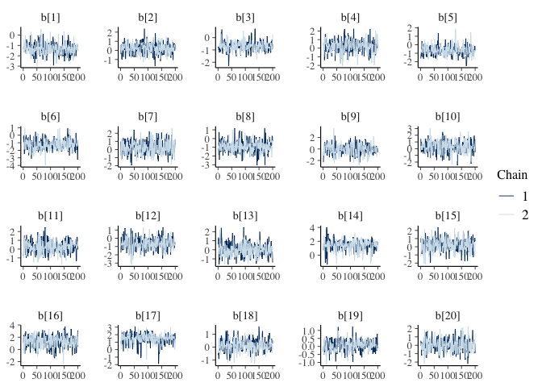
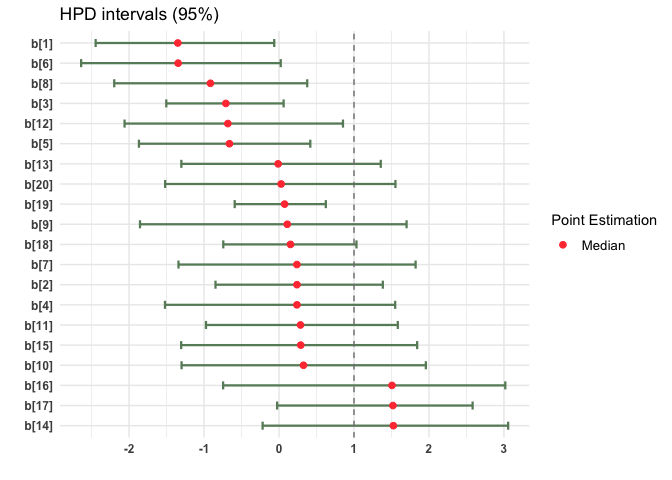

<!-- README.md is generated from README.Rmd. Please edit that file -->

``` r
library(AsymmIRT)
```

# AsymmIRT: Bayesian analysis of asymmetric IRT models (RLPE, LPE) models and symmetric IRT models

<!-- badges: start -->

[](https://github.com/Asymmetrical-irt/AsymmIRT/actions/workflows/R-CMD-check.yaml)
<!-- badges: end -->

AsymmIRT is an R package that provides a comprehensive toolkit for
fitting, diagnosing, and interpreting asymmetric IRT models. The package
currently implement bayesian analysis of asymmetric IRT models (e.g
1PLPE, 1PRLPE, LPE, RLPE) and widely known symmetric models such as 1PL
and 2PL. Other asymmetric IRT models are planned to be implemented in
the future.

## Installation

AsymmIRT uses [`cmdstanr`](https://mc-stan.org/cmdstanr/) (not available
on CRAN). To install it, follow these instructions [Getting started with
CmdStanR](https://mc-stan.org/cmdstanr/articles/cmdstanr.html)

The development version of AsymmIRT can be installed typing:

``` r
remotes::install_github("Asymmetrical-irt/AsymmIRT")
```

## Data simulation

This is a basic example on how to simulate data from the available
asymmetric and symmetric models. The package provides and methods for
examining generated datasets. The method displays summary statistics
including the mean, standard deviation, and range of true parameter
values. The method produces a histogram of total scores, allowing quick
assessment of score distribution characteristics.

``` r
library(AsymmIRT)

n = 25      ## number of individuals
k = 20 ## number of items
model_type   = "LPE"   ## type of model to simulate data from (e.g LPE, RLPE,1PRLPE)
seed = 123  

data <- simData(n=n , k=k, seed=seed, model_type=model_type)


plot(data)
#> 
#> --- Scores plot ---
```

<!-- -->

    #> 
    #> --- Parameters Boxplot ---

<!-- -->

``` r
print(data)
#>         mean    sd proportion_0 proportion_1 kappa
#> Item_1  0.92 0.277         0.08         0.92  0.84
#> Item_2  0.44 0.507         0.56         0.44  0.12
#> Item_3  0.72 0.458         0.28         0.72  0.44
#> Item_4  0.44 0.507         0.56         0.44  0.12
#> Item_5  0.72 0.458         0.28         0.72  0.44
#> Item_6  0.92 0.277         0.08         0.92  0.84
#> Item_7  0.44 0.507         0.56         0.44  0.12
#> Item_8  0.84 0.374         0.16         0.84  0.68
#> Item_9  0.56 0.507         0.44         0.56  0.12
#> Item_10 0.44 0.507         0.56         0.44  0.12
#> Item_11 0.40 0.500         0.60         0.40  0.20
#> Item_12 0.76 0.436         0.24         0.76  0.52
#> Item_13 0.48 0.510         0.52         0.48  0.04
#> Item_14 0.04 0.200         0.96         0.04  0.92
#> Item_15 0.40 0.500         0.60         0.40  0.20
#> Item_16 0.00 0.000         1.00         0.00  1.00
#> Item_17 0.04 0.200         0.96         0.04  0.92
#> Item_18 0.44 0.507         0.56         0.44  0.12
#> Item_19 0.44 0.507         0.56         0.44  0.12
#> Item_20 0.48 0.510         0.52         0.48  0.04
#> 
#> Items unbalanced according to kappa index:
#> [1] "Item_1"  "Item_3"  "Item_5"  "Item_6"  "Item_8"  "Item_12" "Item_14"
#> [8] "Item_16" "Item_17"
```

## Fitting the data to a model

Fitting models using the AsymmIRT package relies on pre-compiled models,
using the instantiate package, which manages the compilation and loading
of the Stan models. It is important to notice that the function
fit_model() accepts the same arguments as the sample method in CmdStanR.

Additionally computing metrics such as WAIC, DIC and loo can be obtained
for the available models using a ’\_log’ suffix. For example, specifying
‘1PLPE_log’ instead of ‘1PLPE’, the output will allow to use the methods
in the package to compute these metrics.

``` r
iter_warmup = 200 ## number of items
iter_sampling = 200      ## number of individuals
model_type   = "1PLPE_log"   ## type of model 
seed = 123  
data = data$df 
chains = 2 ## number of chains
parallel_chains = 2 ## Running chains in parallel
```

Notice that the function fit_model() returns a list of three objects.
The data list, type of model and the **output** which is a R6
CmdStanMCMC object.

``` r
data <- simData(n=25 , k=20, seed=123, model_type="LPE")
fit <- AsymmIRT::fit_model(data = data$df, iter_warmup = iter_warmup, iter_sampling = iter_sampling, mod = "LPE2_log", seed = seed, chains = chains, parallel_chains = parallel_chains)
#> Running MCMC with 2 parallel chains...
#> 
#> Chain 1 Iteration:   1 / 400 [  0%]  (Warmup) 
#> Chain 1 Iteration: 100 / 400 [ 25%]  (Warmup) 
#> Chain 2 Iteration:   1 / 400 [  0%]  (Warmup) 
#> Chain 2 Iteration: 100 / 400 [ 25%]  (Warmup) 
#> Chain 1 Iteration: 200 / 400 [ 50%]  (Warmup) 
#> Chain 1 Iteration: 201 / 400 [ 50%]  (Sampling) 
#> Chain 2 Iteration: 200 / 400 [ 50%]  (Warmup) 
#> Chain 2 Iteration: 201 / 400 [ 50%]  (Sampling) 
#> Chain 1 Iteration: 300 / 400 [ 75%]  (Sampling) 
#> Chain 2 Iteration: 300 / 400 [ 75%]  (Sampling) 
#> Chain 1 Iteration: 400 / 400 [100%]  (Sampling) 
#> Chain 2 Iteration: 400 / 400 [100%]  (Sampling) 
#> Chain 1 finished in 0.4 seconds.
#> Chain 2 finished in 0.4 seconds.
#> 
#> Both chains finished successfully.
#> Mean chain execution time: 0.4 seconds.
#> Total execution time: 0.5 seconds.
#> Warning: 1 of 400 (0.0%) transitions ended with a divergence.
#> See https://mc-stan.org/misc/warnings for details.
```

``` r
code(fit)
#>  [1] "data {"                                                     
#>  [2] "  int<lower=0> n;"                                          
#>  [3] "  int<lower=0> k;"                                          
#>  [4] "  array[n, k] int<lower=0, upper=1> Y;"                     
#>  [5] "}"                                                          
#>  [6] "parameters {"                                               
#>  [7] "  vector[n] theta;"                                         
#>  [8] "  vector[k] b;"                                             
#>  [9] "  vector<lower=0>[k] a;"                                    
#> [10] "  vector<lower=0>[k] lambda;"                               
#> [11] "}"                                                          
#> [12] "transformed parameters{"                                    
#> [13] ""                                                           
#> [14] "  matrix[n,k] m;"                                           
#> [15] "  matrix<lower=0, upper=1>[n, k] pl;"                       
#> [16] "  matrix<lower=0, upper=1>[n, k] prob;"                     
#> [17] ""                                                           
#> [18] " for (j in 1:k) {"                                          
#> [19] "    m[, j] = a[j] * (theta - b[j]);"                        
#> [20] "  }"                                                        
#> [21] "  pl = inv_logit(m);"                                       
#> [22] "   for (j in 1:k) {"                                        
#> [23] "    prob[, j] = pow(pl[, j], lambda[j]);"                   
#> [24] "  }"                                                        
#> [25] ""                                                           
#> [26] "}"                                                          
#> [27] "model {"                                                    
#> [28] "  theta ~ normal(0,1);"                                     
#> [29] "  b ~ normal(0,1);"                                         
#> [30] "  a ~ lognormal(0,1);"                                      
#> [31] "  lambda ~ lognormal(0, sqrt(0.5));"                        
#> [32] ""                                                           
#> [33] "  for (j in 1:k) {"                                         
#> [34] "    Y[, j] ~ bernoulli(prob[, j]);"                         
#> [35] "  }"                                                        
#> [36] "}"                                                          
#> [37] ""                                                           
#> [38] "generated quantities {"                                     
#> [39] "  matrix[n, k] log_lik;"                                    
#> [40] "  real dev;"                                                
#> [41] "  dev = 0;"                                                 
#> [42] ""                                                           
#> [43] "  for (j in 1:k) {"                                         
#> [44] "    for (i in 1:n) {"                                       
#> [45] "      log_lik[i, j] = bernoulli_lpmf(Y[i, j] | prob[i, j]);"
#> [46] "      dev = dev + (-2)*log_lik[i,j];"                       
#> [47] "    }"                                                      
#> [48] "  }"                                                        
#> [49] "}"                                                          
#> [50] ""
```

Here we can see the code of the model. In this example priors are

")

")

")

The model 1PLPE is:

 = \left( \frac{\exp(\theta - b)}{1 + \exp(\theta - b) } \right)^{\lambda_{j}}")

Now it is possible to delve into the bayesian analysis. Notice that WAIC
and loo accept other arguments, for further information visit the
webpage of the **loo** package.

``` r
summary(fit,variable = c("b","theta","lambda"), ci = 0.95)
#> # A tibble: 65 × 12
#>    variable    mean median    sd   mad     q5     q95  rhat ess_bulk ess_tail
#>    <chr>      <dbl>  <dbl> <dbl> <dbl>  <dbl>   <dbl> <dbl>    <dbl>    <dbl>
#>  1 b[1]     -1.34   -1.35  0.569 0.509 -2.22  -0.244  0.999     389.     344.
#>  2 b[2]      0.228   0.239 0.587 0.586 -0.754  1.22   1.00      477.     367.
#>  3 b[3]     -0.694  -0.709 0.391 0.336 -1.29  -0.0605 1.01      322.     296.
#>  4 b[4]      0.202   0.239 0.771 0.694 -1.12   1.42   1.00      310.     219.
#>  5 b[5]     -0.646  -0.662 0.588 0.512 -1.61   0.344  1.01      382.     289.
#>  6 b[6]     -1.27   -1.35  0.685 0.632 -2.30  -0.0817 1.01      467.     306.
#>  7 b[7]      0.278   0.239 0.810 0.865 -1.02   1.63   1.01      461.     344.
#>  8 b[8]     -0.900  -0.915 0.669 0.582 -2.02   0.249  1.01      542.     312.
#>  9 b[9]      0.0287  0.110 0.937 0.905 -1.46   1.48   1.00      397.     289.
#> 10 b[10]     0.320   0.327 0.892 0.923 -1.09   1.71   0.999     432.     272.
#> # ℹ 55 more rows
#> # ℹ 2 more variables: HDI_low <dbl>, HDI_high <dbl>
```

``` r
DIC(fit)
#> DIC ------
#> [1] 469.2878
```

``` r
WAIC(fit)
#> Warning: 
#> 20 (4.0%) p_waic estimates greater than 0.4. We recommend trying loo instead.
#> WAIC ------
#> 
#> Computed from 400 by 500 log-likelihood matrix.
#> 
#>           Estimate   SE
#> elpd_waic   -218.3 10.3
#> p_waic        39.7  2.8
#> waic         436.5 20.5
#> 
#> 20 (4.0%) p_waic estimates greater than 0.4. We recommend trying loo instead.
```

``` r
loo(fit)
#> Warning: Some Pareto k diagnostic values are too high. See help('pareto-k-diagnostic') for details.
#> LOO ------
#> 
#> Computed from 400 by 500 log-likelihood matrix.
#> 
#>          Estimate   SE
#> elpd_loo   -219.9 10.4
#> p_loo        41.3  3.0
#> looic       439.9 20.8
#> ------
#> MCSE of elpd_loo is NA.
#> MCSE and ESS estimates assume MCMC draws (r_eff in [0.5, 1.7]).
#> 
#> Pareto k diagnostic values:
#>                           Count Pct.    Min. ESS
#> (-Inf, 0.62]   (good)     478   95.6%   74      
#>    (0.62, 1]   (bad)       21    4.2%   <NA>    
#>     (1, Inf)   (very bad)   1    0.2%   <NA>    
#> See help('pareto-k-diagnostic') for details.
```

Lets plot the item icc and item info

``` r
item_icc(fit, item = 2, theta_lim = c(-4,4))
```

<!-- -->

``` r
item_info(fit, item = 2, theta_lim = c(-4,4))
```

<!-- -->

To visually diagnose the convergence of the MCMC chains, the package
AsymmIRT also allows to obtain traceplots of the parameter

``` r
plot_trace(fit, variable = "b")
```

<!-- -->

Adittionally, to plot the HPD intervals alongside the estimation median
the user can use the plot method of the Asymmfit class

``` r
plot(fit, variable = "b")
```

<!-- -->
